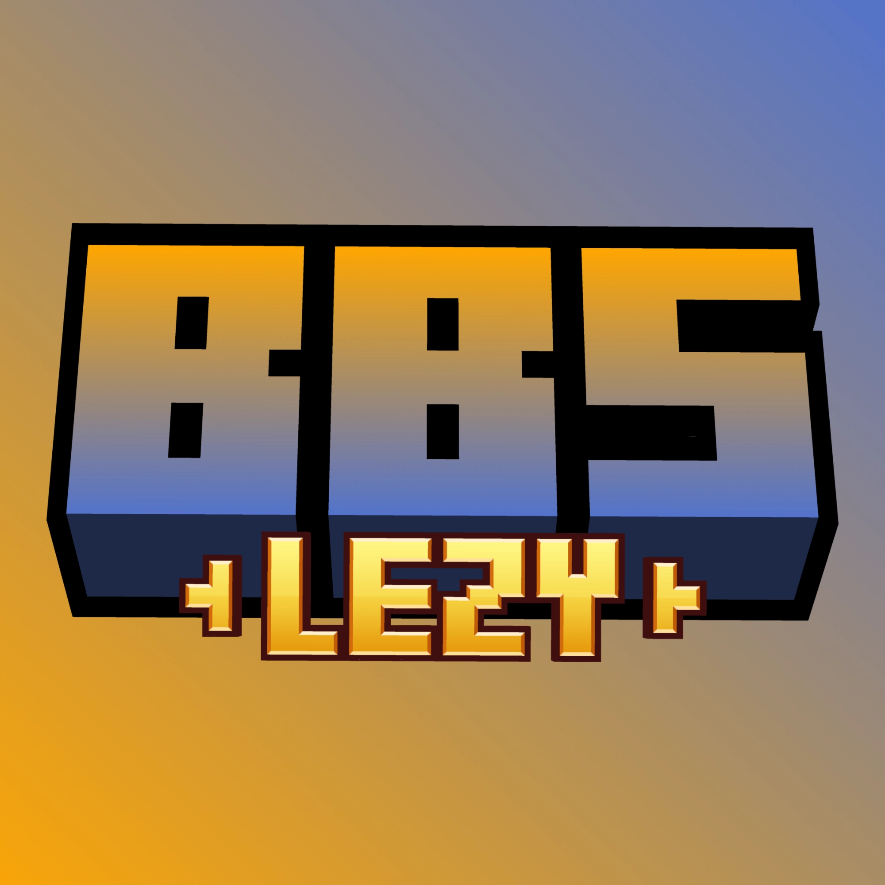

# BBS Lezy

<p align="center"></p>

---

BBS Lezy adalah addon untuk membantu proses pembuatan konten Minecraft Leji dengan target video seperti Grox, Reff, Remanrhn, dll

Addon ini berisi perbaikan-perbaan kecil yang dirancang untuk scene berskala besar: ribuan actor di film BBS, daftar replay yang panjang, dan export video yang sering gagal di tengah jalan. Semua fitur bisa dipakai langsung dari editor BBS, tanpa perlu ngoprek config.

## Fitur

**1. Batas render model (LOD)**

Nggak semua model replay dirender setiap frame — hanya yang terdekat dengan kamera yang masuk hitungan. Berguna banget pas scene punya ribuan actor sampai GPU menangis. Model yang terpilih untuk di-hide dimanipulasi lewat runtime value BBS, jadi keyframe animasi nggak rusak. Pas rendering/export video, tinggal dimatiin biar semua model tergambar.

**2. Panel replay**

- **Select all replays** — pilih semua replay di film, termasuk yang ada di dalam folder tertutup (select-all bawaan BBS cuma yang terlihat di layar).
- **Select same model** — pilih semua replay yang model-nya sama dengan seleksi sekarang. Cocok untuk ambil semua hasil duplicate farm dalam satu kali klik.
- **Duplicate to total** — angka yang dimasukkan adalah **total** copy di seluruh seleksi, bukan per-replay. Misal: pilih 3 replay, input 150, hasilnya 150 copy (50 per replay), bukan 450. Tiap replay dapat kategori sendiri (`Duplicates N`) biar gampang dikontrol atau dihapus.
- **Tombol scroll ▲▼** — lompat instant ke atas atau ke bawah daftar replay, tanpa animasi. Berguna pas daudarnya udah ribuan baris.

**3. Perbaikan dari fork BBS**

- **F6 warmup fix** — export video (Record & Replay) nggak lagi abort prematur saat warmup, terutama kalau filmnya dilakukan secara asynchronous.
- **Keybind K: toggle shader** — tekan **K** di dashboard untuk nyalain/matemin Iris shader langsung, tanpa keluar dari editor. Dikerjakan lewat refleksi, jadi nggak butuh dependency compile Iris; kalo Iris nggak terinstall, keybind-nya diam.
- **Async texture loading** — proses MultiLink (texture) dipindah ke thread pool terpisah, jadi main thread nggak tersendat pas banyak textur dimuat sekaligus.

## Dokumentasi

### Requirement

| Item      | Versi                                        |
| --------- | -------------------------------------------- |
| Minecraft | 1.20.1                                       |
| Java      | 17+                                          |
| Fabric    | Loader 0.16.14, Fabric API 0.92.1+1.20.1     |
| BBS FS    | 2.7-1.20.1                                   |
| Sodium    | 0.5.8 (sudah include)                        |
| Iris      | Opsional (shader belum ditest di dev client) |

### Install

1. Download file `.jar` dari [Releases](../../releases) (nggak perlu git clone).
2. Drop ke folder `mods` seperti addon Fabric pada umumnya.

### Setting LOD

Ada tiga setting, bisa diubah dari dua tempat:

**Lewat settings screen BBS** (ikon gerigi → kategori BBS Lezy):

| Setting             | Range  | Keterangan                                                                                                                                              |
| ------------------- | ------ | ------------------------------------------------------------------------------------------------------------------------------------------------------- |
| Render limit        | on/off | Nyalain/matemin seluruh fitur batas render.                                                                                                             |
| Max rendered models | 0–2000 | Jumlah model yang tetap dirender per frame. Sisanya di-hide. **0 = mati** (semua dirender).                                                             |
| Focus distance      | 0–256m | Prioritas model di sekitar jarak ini dari kamera. **0 = model terdekat** yang menang. Bisa dipakai untuk ngeliat replay jauh tanpa naikin render limit. |

**Lewat toolbar preview film editor** — klik ikon mata (👁, sebelah tombol motion path) untuk buka popup: toggle On/Off, slider Render Limit, slider Focus Distance. Perubahan otomatis kesimpan ke `bbslezy.json`.

File setting-nya ada di `<folder config BBS>/bbs/settings/bbslezy.json`.

### Build dari source

```bash
sh ./gradlew build
```

Hasilnya ada di `build/libs/bbs-lezy-<versi>.jar`.

> Catatan: BBS-nya sendiri harus sudah ter-publish ke maven local dulu (`sh ./gradlew publishToMavenLocal` dari folder BBS). Addon ini dikunci ke BBS 2.7-1.20.1 — versi BBS beda bikin dev environment aneh.

### Catatan teknis

- **Mixin UI bersifat fail-safe**: `bbslezy.mixins.json` pake `required: false` + `defaultRequire: 0`. Kalau BBS internal berubah dan mixin gagal, addon tetap jalan — cuma fitur no. 2 dan 3 yang ilang, fitur LOD (no. 1) tetap aman karena lewat API resmi.
- **Restore override hanya dilakukan di `RENDER_AFTER` dan `SHUTDOWN`**, bukan di render pass biasa, karena shadow dan name tag digambar setelahnya.
- **Budget dihitung sebagai squared distance** — nggak ada `sqrt` dan nggak ada alokasi `Vec3d` per form, biar murah pas ribuan actor.
- Form yang terkunci ke kamera (`anchor` punya target) nggak ikut di-cull, sama seperti behavior bawaan BBS.
- Editor click tetap bisa select actor yang lagi di-cap — pass picking di-skip dari culling.

## License

MIT — bebas dipake dan dimodifikasi. Bosan dengan bug? Pull request terbuka.
