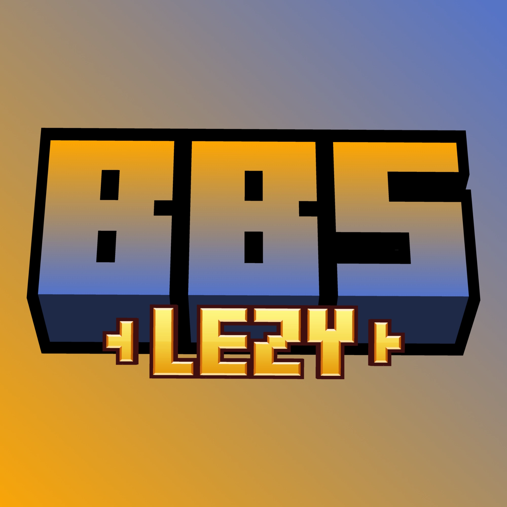

# BBS Lezy

<p align="center"></p>

<p align="center">
  <a href="README.md">English</a>  |  <b>Bahasa Indonesia</b>
</p>

---

BBS Lezy adalah addon untuk membantu proses pembuatan konten Minecraft Leji dengan target video seperti Grox, Reff, Remanrhn, dll.

Addon ini dirancang untuk scene berskala besar dan kemudahan editing: batas render model (LOD) untuk ribuan actor, manajemen panel replay massal, **export video 2 track audio terpisah** (klip BBS + suara Minecraft), **pembacaan langsung berbagai format audio** (.mp3, .m4a, .opus, .flac, dll) tanpa konversi, serta perbaikan workflow lainnya. Semua fitur dapat dikonfigurasi langsung dari editor BBS tanpa perlu ngoprek file config secara manual.

## Fitur

**1. Batas render model (Limit Replay)**

Nggak semua model replay dirender setiap frame — hanya yang terdekat dengan kamera yang masuk hitungan. Berguna banget pas scene punya ribuan actor sampai GPU menangis. Model yang terpilih untuk di-hide dimanipulasi lewat runtime value BBS, jadi keyframe animasi nggak rusak. Pas rendering/export video, tinggal dimatiin biar semua model tergambar.

**2. Panel replay**

- **Select all replays** — pilih semua replay di film, termasuk yang ada di dalam folder tertutup (select-all bawaan BBS cuma yang terlihat di layar).
- **Select same model** — pilih semua replay yang model-nya sama dengan seleksi sekarang. Cocok untuk ambil semua hasil duplicate farm dalam satu kali klik.
- **Duplicate to total** — angka yang dimasukkan adalah **total** copy di seluruh seleksi, bukan per-replay. Misal: pilih 3 replay, input 150, hasilnya 150 copy (50 per replay), bukan 450. Tiap replay dapat kategori sendiri (`Duplicates N`) biar gampang dikontrol atau dihapus.
- **Tombol scroll atas/bawah** — lompat instant ke atas atau ke bawah daftar replay, tanpa animasi. Berguna pas daudarnya udah ribuan baris.
- **Reset replay actors** — menu klik kanan di panel list replay untuk me-respawn semua replay actor kembali ke posisi awal dan menyegarkan display-nya, tanpa perlu keluar-masuk dashboard.

**3. Audio export & codec**

- **Separate audio tracks (2 track audio terpisah)** — saat export video dengan opsi bawaan BBS **audio** dan **minecraft sounds** dua-duanya aktif, hasil video membawa **dua track audio terpisah** (Track 1: audio klip film BBS, Track 2: efek suara/SFX Minecraft) bukan satu track campuran. Setiap track dipaksa stereo 2-channel standar (AAC 192k) sehingga langsung rapi saat diimpor ke software editing (Premiere Pro, DaVinci Resolve, CapCut, Vegas Pro, dll). File WAV sementara otomatis dibersihkan setelah mux selesai.
- **Multi-codec audio langsung & dikenali di Pick Audio** — BBS kini bisa langsung membaca `.mp3`, `.m4a`, `.aac`, `.opus`, `.wma`, `.alac`, `.ape`, `.flac`, `.aif/.aiff`, dan `.ac3`. File-file ini langsung terdeteksi di menu "Pick audio...", bisa dipreview waveform-nya, diedit (offset, durasi, volume), dicut/split di timeline, dan dirender layaknya WAV bawaan. Decode berjalan on-demand via ffmpeg, sehingga file asli di disk tidak pernah diubah atau dikonversi.
- **Import file audio tanpa konversi** — file audio yang di-drag & drop ke dalam BBS langsung disalin **apa adanya** (byte-identical), tidak lagi dire-encode paksa menjadi WAV mono. Khusus file video (`.mp4`), audionya tetap diekstrak otomatis seperti biasa.

**4. Screen effect clips**

Hasil porting dari BBS CML milik ElgatoPro300 — makasih!

https://github.com/user-attachments/assets/169defa4-20fe-452a-8dac-c3a78e5c6c52

- **Cinematic Effect** — satu clip yang menggabungkan efek kamera jadul: vintage film (flicker, goresan acak, desaturasi), framing / letterbox, film grain, dan optik (fisheye, chromatic aberration, VHS glitch, radial blur). Tiap efek punya parameter sendiri dan bisa dikombinasikan.
- **Color Grade** — color grading murni (saturation, hue, brightness, contrast, lift, gamma, gain) plus flat overlay tint.
- **Vignette** — penggelapan radial di tepi frame.
- **Letterbox** — bar sinematik dengan preset rasio aspek (Scope 2.39:1, Cinema, Univisium, Flat, 16:9, 4:3, Square, 9:16 Shorts, Custom), dukungan pillarbox buat video vertikal, feather tepi dalam, warna, offset, rotasi, dan zoom.
- **Camera Shake** — goyangan handheld prosedural dengan preset Gentle / Action / Explosion plus atur amplitudo per sumbu.
- **Impact Frame** — freeze frame, flash layar, punch-in FOV, dan impulse shake dalam satu clip, dengan preset Anime Impact / Hard Hit / Explosion / Dramatic.
- **Hierarki clip per track** — efek ngikutin urutan track di camera timeline, dari track paling bawah ke atas, jadi grade di track atas jadi lapisan di atas grade track bawah — bukan kecampur jadi satu look. Clip yang se-track tetap ditumpuk seperti biasa, dan film yang semuanya se-track tetap cuma satu pass.

**5. Illusion (duplikasi visual)**

- Duplikat visual di sekitar form atau model block **tanpa menambah entitas** — satu actor kelihatan jadi 10 tanpa beban entity. 6 arah, spread, opacity fade, toggle **Enabled**, dll. (Uniform Distance, Real, Distort, Gradual Transform).
- Bisa di-keyframe lewat Dope Sheet (track `illusion` dan `illusion_transform`), semuanya diatur dari section **Illusion** di Form Editor. Hasil porting dari BBS CML milik ElgatoPro300.

**6. Video export (CQP, codec & GPU)**

- **Video CQP** — atur kualitas/kompresi (0–51, default 18).
- **Video Codec** — pilih `h264` (default, kompatibilitas maksimum), `h265` (HEVC, kompresi lebih baik), atau `vp9` (WebM).
- **Hardware Acceleration (GPU)** — pakai encoder GPU (NVIDIA NVENC, AMD AMF di Windows / VA-API di Linux, Intel QSV dengan fallback VA-API di Linux) buat render jauh lebih cepat dan beban CPU lebih ringan. Default: **nyala**. Ada opsi **Auto-Detect GPU** atau pilih vendor tertentu.
- **Peringatan codec GPU** — kalau codec yang dipilih (mis. VP9) atau GPU / build ffmpeg tidak mendukung hardware encoder tersebut, muncul dialog yang nawarin encode pakai CPU untuk export itu saja.
- **Perbaikan Linux (QoL)** — slider terbatas membungkus kursor di tepi jendela pada Linux/XWayland seperti trackpad biasa, export video Linux otomatis mendeteksi dan memakai NVENC, Intel QSV (fallback ke VA-API bila QSV tidak terdeteksi), atau AMD VA-API sesuai render node, serta menyalakan/reload shaderpack Iris di dalam editor BBS menjadwalkan reload bersih saat editor ditutup.

**7. Framing guides**

- Tombol toggle di toolbar preview film: klik kiri nyala/matiin semua guide (setup terakhir diingat), klik kanan buat milih guide mana yang tampil.
- Safe area (Action 90%, Title 80%), overlay vertikal 9:16 dan scope 2.39:1, plus center lines dan crosshair bawaan BBS.
- Warna, opacity, dan label diatur dari setting BBS Lezy.

**8. Dll.**

Hal-hal kecil yang nggak dapat section sendiri: clip halftone, channel motion blur & pixelation, skin search dengan preview 3D, Look At batch baking, damage action clip, snap-player-to-preview, reverse audio dengan volume keyframes, open-folder-on-import, perbaikan cursor wrap Linux & Iris depth, toggle shader dashboard (K).

## Dokumentasi

### Requirement

| Item      | Versi                                    |
| --------- | ---------------------------------------- |
| Minecraft | 1.20.1                                   |
| Java      | 17+                                      |
| Fabric    | Loader 0.16.14, Fabric API 0.92.1+1.20.1 |
| BBS FS    | 2.7-1.20.1                               |
| Sodium    | 0.5.8                                    |
| Iris      | Opsional (untuk dukungan shader)         |
| ffmpeg    | Kamu install sendiri (tidak dibundel)    |

### Install

1. Download file `.jar` dari [Releases](../../releases) (nggak perlu git clone).
2. Drop ke folder `mods` seperti addon Fabric pada umumnya.

### Setting Lezy

Semua setting bisa diubah dari dua tempat:

**Lewat settings screen BBS** (ikon gerigi → kategori BBS Lezy):

| Setting                 | Range   | Keterangan                                                                                                                                                                                                        |
| ----------------------- | ------- | ----------------------------------------------------------------------------------------------------------------------------------------------------------------------------------------------------------------- |
| Enable render limit     | on/off  | Nyalain/matemin seluruh fitur batas render.                                                                                                                                                                       |
| Max rendered models     | 0–2000  | Jumlah model yang tetap dirender per frame. Sisanya di-hide. **0 = mati** (semua dirender).                                                                                                                       |
| Focus distance          | 0–256m  | Prioritas model di sekitar jarak ini dari kamera. **0 = model terdekat** yang menang. Bisa dipakai untuk ngeliat replay jauh tanpa naikin render limit.                                                           |
| Separate audio tracks   | on/off  | Hasil export bawa dua track audio terpisah (klip BBS + suara Minecraft). Cuma ngaruh pas opsi export BBS **audio** dan **minecraft sounds** dua-duanya nyala. Mati = satu track campuran kayak biasa.             |
| Open folder on import   | on/off  | Otomatis buka File Explorer ke folder tujuan saat drag & drop file ke BBS. Default: **mati** (tidak otomatis buka folder).                                                                                        |
| Baking batch percentage | 1–100%  | Mengatur seberapa agresif / persentase total replay yang diproses per kelompok frame saat Look At baking. Nilai tinggi = lebih cepat selesai, nilai rendah = progress bar lebih halus & stabil (default: **5%**). |
| Video CQP (Quality)     | 0–51    | Constant Quantization Parameter. Makin kecil makin bagus kualitasnya, makin besar makin kecil filenya. **0 = lossless**, 18 = default (high quality), 23 = seimbang, 28 = file kecil.                             |
| Video Codec             | pilihan | `h264` (default, kompatibilitas maksimum), `h265` (HEVC, kompresi lebih baik), atau `vp9` (WebM).                                                                                                                 |
| Hardware Acceleration   | on/off  | Pakai encoder GPU (NVIDIA NVENC / AMD AMF / Intel QSV) buat render jauh lebih cepat. Default: **nyala**.                                                                                                          |
| GPU Encoder             | pilihan | Vendor encoder yang dipakai: Auto-Detect (dari GPU OpenGL yang aktif), NVIDIA (NVENC), AMD (AMF), atau Intel (QSV).                                                                                               |

**Lewat toolbar preview film editor** — klik ikon mata (sebelah tombol motion path) untuk buka popup: toggle On/Off, slider Render Limit, slider Focus Distance. Perubahan otomatis kesimpan ke `bbslezy.json`.

File setting-nya ada di `<folder config BBS>/bbs/settings/bbslezy.json`.

### Build dari source

```bash
sh ./gradlew build
```

Hasilnya ada di `build/libs/bbs-lezy-<versi>.jar`.

> Catatan: BBS-nya sendiri harus sudah ter-publish ke maven local dulu (`sh ./gradlew publishToMavenLocal` dari folder BBS). Addon ini dikunci ke BBS 2.7-1.20.1 — versi BBS beda bikin dev environment aneh.

### Catatan teknis

- **Mixin UI bersifat fail-safe**: `bbslezy.mixins.json` pake `required: false` + `defaultRequire: 0`. Kalau BBS internal berubah dan mixin gagal, addon tetap jalan — cuma fitur panel replay dan audio yang ilang, fitur Limit Replay tetap aman karena lewat API resmi. Target mixin baru: `VideoExportSession` (two-track export), `AudioReader` (codec), `ToWAVImporter`/`WAVImporter` (no-conversion import), `UISoundOverlayPanel` (pick audio), `UIScreen` (drag-import auto open folder toggle), `UIProcessReplaysPanel` (Look at per-tick & async baking), `UIFormUndoHandler` (single compound undo).
- **Restore override hanya dilakukan di `RENDER_AFTER` dan `SHUTDOWN`**, bukan di render pass biasa, karena shadow dan name tag digambar setelahnya.
- **Budget dihitung sebagai squared distance** — nggak ada `sqrt` dan nggak ada alokasi `Vec3d` per form, biar murah pas ribuan actor.
- Form yang terkunci ke kamera (`anchor` punya target) nggak ikut di-cull, sama seperti behavior bawaan BBS.
- Editor click tetap bisa select actor yang lagi di-cap — pass picking di-skip dari culling.
- **ffmpeg tetap eksternal**: fitur audio/video manggil binary `ffmpeg` yang kamu sediakan sendiri (lewat `PATH` atau setting BBS) sebagai proses terpisah — nggak ada kode/binary ffmpeg yang di-link atau dibundel bareng mod ini.

## Credit

Sebagian besar keseruan di sini berawal dari karya orang-orang ini, jadi makasih banyak buat:

- [McHorse](https://www.youtube.com/@McHorsesCreations) — pembuat BBS (Blockbuster), mod original yang jadi fondasi semuanya.
- [Wemmpy](https://www.youtube.com/@Wemppy4) — pembuat BBS FS, fork yang jadi target addon ini.
- [ElgatoPro300](https://www.youtube.com/@ElGatoPro300) — screen effect clips dan illusion, hasil porting dari BBS CML miliknya.

dan AI yang bersedia untuk dipecut 😈

## License

MIT — bebas dipake dan dimodifikasi. Bosan dengan bug atau pengen nambahin fitur? Fork aja sendiri
